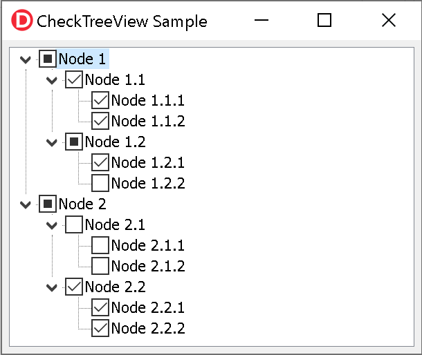

# Introduction
This library provides an easy way to add tristate checkboxes (checked, unchecked, partial) to your existing `TTreeView` Delphi VCL control, using native Windows API (Windows Vista an up. Sorry, XP folks).



To use it, just add the unit `CheckTreeView` to your form unit:

```delphi
  uses {...}, CheckTreeView;
```

It contains a class helper for the `TTreeView` component, so it will add methods to any existing `TTreeView` component you might have in your form.

## Enabling tristate checkboxes

Just call `EnableTristateCheckboxes` method:

```delphi
  TreeView1.EnableTristateCheckboxes;
```

This is enough to add checkboxes to all nodes, and change the node check state when users clicks the checkbox or press `space` key when a node is selected.

## Reading or changing the check state of a node

You can use `CheckState` property of a node to read or modify the state of the checkbox:

```delphi
  Node := TreeView1.Selected;
  case Node.CheckState of
    csUnchecked: Node.Text := 'unchecked';
    csChecked: Node.Text := 'checked';
    csPartial: Node.Text := 'partial';
  end;
```

```delphi
  TreeView1.Selected.CheckState := csChecked;
```

## Automatic check states

If you want the `TTreeView` control to perform these operations automatically when the user checks/unchecked a node:

1. Check/uncheck all child items of the modified node;
1. Update the parent node check state based on the check state of the child nodes;
1. Allow just check/uncheck state for the modified node.

Then add `OnMouseDown` and `OnKeyPress` event handlers for your `TTreeView` component and add the following code:

```delphi
procedure TForm6.TreeView1KeyPress(Sender: TObject; var Key: Char);
begin
  TreeView1.HandleKeyPress(Key);
end;

procedure TForm6.TreeView1MouseDown(Sender: TObject; Button: TMouseButton; Shift: TShiftState; X, Y: Integer);
begin
  TreeView1.HandleMouseDown(Button, Shift, X, Y);
end;
```

